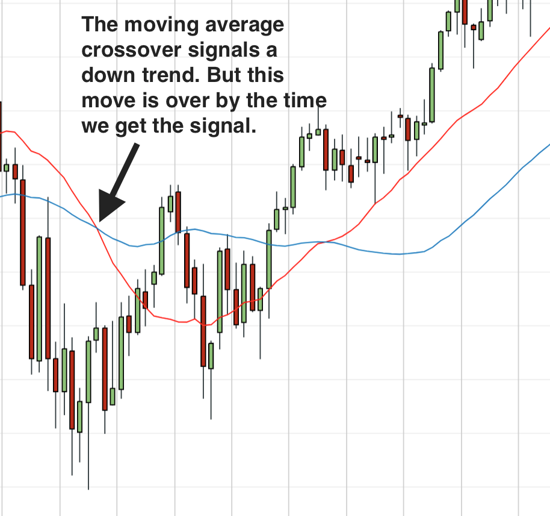
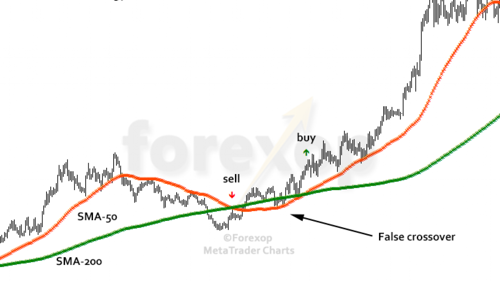

# Using the Alpaca API to paper trade  
Alpaca is a securities broker with a free-to-use API for stock trading. In this project we use it to paper trade with Python.  
# Double Exponential Moving Average (DEMA)  
The algorithm/strategy used in this project is the Double Exponential Moving Average. The idea is that we compare 2 double exponential moving averages with different windows over time. We buy when the "fast" DEMA line (the one with a shorter window) crosses above the "slow" DEMA line (longer window) and sell when the fast crosses the slow below. In this code, the DEMA lines are updated every minute during market open (hence the time.sleep(60)).  
# Weaknesses  
1. Any moving average will lag behind the actual data.   
2. Volatility might result in false crossovers.   
# Implementation  
We could schedule this to run daily in the cloud (e.g. pythonanywhere) or locally with task scheduler (Windows).  
# Further improvements  
Our fast and slow values/windows seem quite arbitrary. I could possibly dynamically adjust them with some equation or use machine learning to do so. Such a solution would probably take into account stock volatility, market volatility, beta, etc.
